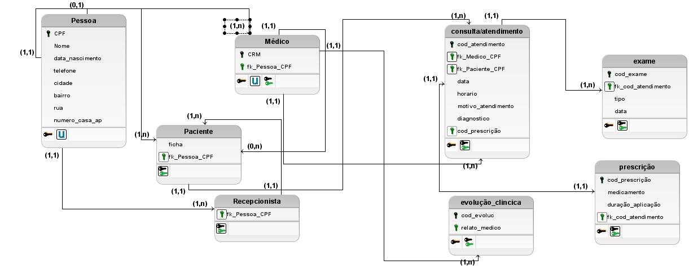
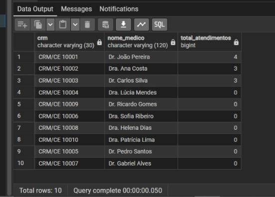
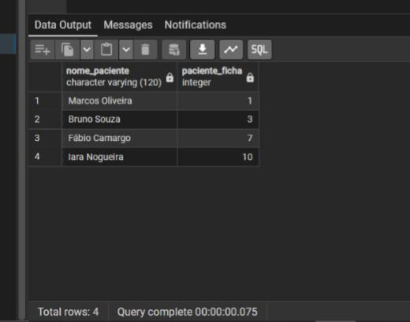
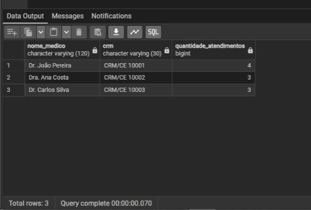
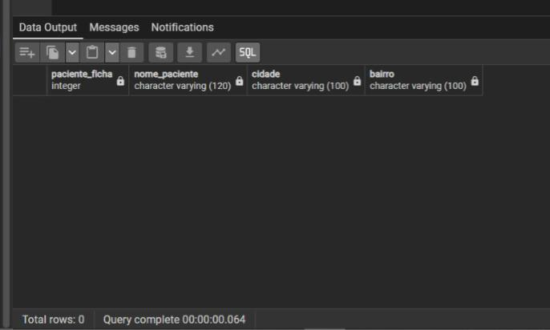
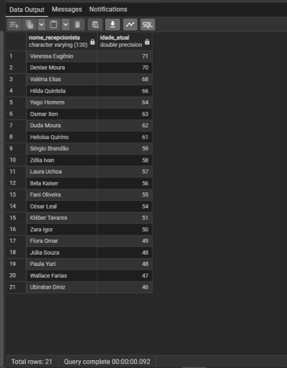
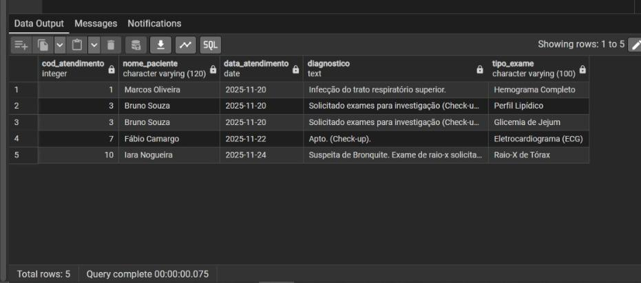
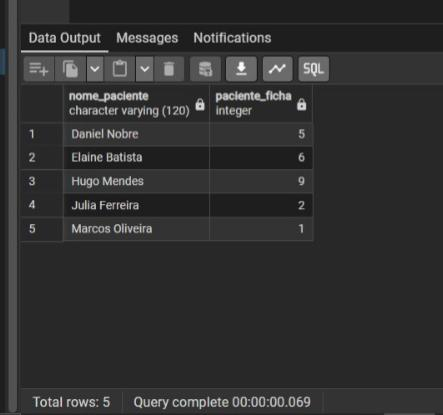
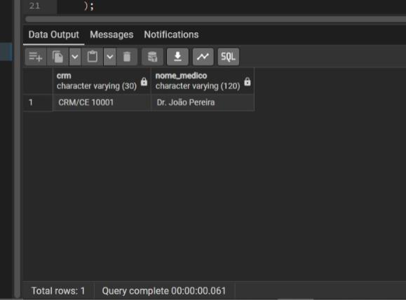
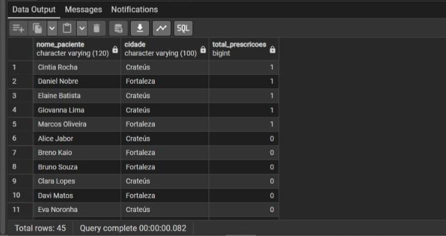

### <b><h1 align="center">Trabalho para Avaliação Parcial 3 de Banco de Dados</h1></b>
<h4>PROFESSOR: Adeilson Sales Aragão </h4>
<h2 align="center"><i> Mikael Diogo Ferreira e Victor Hugo Sales Paz </h2>

<h2>Modelo Lógico:</h2>

<b>Consulta 1: Contagem de Atendimentos por Médico (Função Agregada, GROUP BY)</b>
Descrição: Conta o número total de atendimentos realizados por cada médico no sistema.

<h2>RESULTADO:</h2>

<b>Consulta 2: Pacientes que Fizeram Exames (JOIN e EXISTS)</b>
Descrição: Lista o nome dos pacientes que possuem pelo menos um registro na tabela

<h2>RESULTADO:</h2>

<b>Consulta 3: Médicos com Mais de 2 Atendimentos (Função Agregada, GROUP BY e HAVING)</b>
Descrição: Lista os médicos que realizaram mais de dois (> 2) atendimentos.

<h2>RESULTADO:</h2>

<b>Consulta 4: Pacientes sem Endereço de Bairro (LEFT JOIN e IS NULL)</b>
Descrição: Lista todos os pacientes que não têm o campo bairro preenchido na tabela pessoa.

<h2>RESULTADO:</h2>

<b>Consulta 5: Prescrições de um Atendimento Específico (IN)</b>
Descrição: Retorna todos os medicamentos prescritos em um conjunto específico de atendimentos (códigos 1 e 6).

<h2>RESULTADO:</h2>

<b>Consulta 6: Recepcionistas Mais Velhas que a Média Geral (Consulta Aninhada, CTE, Cálculo de Idade)</b>
Descrição: Lista as recepcionistas cuja idade é MAIOR que a idade média de todos os funcionários (Médicos + Recepcionistas).

<h2>RESULTADO:</h2>

<b>Consulta 7: Detalhes de Atendimentos com Exames Registrados (INNER JOIN em 3 Tabelas)</b>
Descrição: Lista os detalhes dos atendimentos que resultaram em algum exame, incluindo o nome do paciente.

<h2>RESULTADO:</h2>

<b>Consulta 8: Pacientes que Tiveram Evolução Clínica Registrada (INNER JOIN Simples)</b>
Descrição: Lista o nome e a ficha dos pacientes que tiveram algum registro de evolução clínica no seu atendimento.

<h2>RESULTADO:</h2>

<b>Consulta 9: Médicos que Atenderam Pacientes com Mais de 70 Anos (Consulta Aninhada e Cálculo de Idade)</b>
Descrição: Encontra os médicos que atenderam pacientes com mais de 70 anos na data de hoje.

<h2>RESULTADO:</h2>

<b>Consulta 10: Contar Prescrições por Paciente e Filtrar Cidades (JOIN e IN)</b>
Descrição: Conta quantas prescrições cada paciente de Fortaleza ou Crateús recebeu.

<h2>RESULTADO:</h2>

